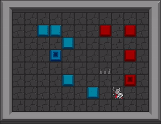
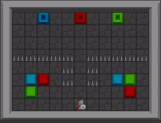

# RLlib Single Agent Example - GridMan

<div style="text-align: center">
    
    
    
</div>

More documentation can be found [here](https://griddly.readthedocs.io/en/latest/rllib/single-agent/index.html)

This repository can be used as a starter for training any of the Griddly environemnts using RLLib

This example trains the "GridMan" environment!

## Installing Dependencies

We use poetry to manage the dependencies of this project. You can set up a poetry environment with the command:

```commandline
poetry install
```

You can then activate the poetry environment using:

```commandline
poetry shell
```

## Training the example environment

```commandline
python train.py
```

### Options for training

There are three variables that you can change in train.py:

```python
environment_name = "TestEnvironment"
environment_yaml = "gridman/gridman.yaml"
model_name = "SimpleConvAgent"
```

#### environment_name

The name of the environment

#### environment_yaml

the yaml file containing the GDY of the environment (in this example we're using Gridman)

#### model_name

We provide two simple models that can be used are `SimpleConvAgent` and `GlobalAveragePoolingAgent`


## Play

You can play the game yourself by running:

```commandline
python play.py
```

You will have the same partial view of the environment that the agent has i.e a 7x7 grid:

<div style="text-align: center">
    
</div>

When player a video of the global state of the game is recorded with the name
`human_player_video_test.mp4`

## Citing

If you use this environment, please cite the original Griddly Paper: 

```commandline
@article{
  author    = {Chris Bamford and
               Shengyi Huang and
               Simon M. Lucas},
  title     = {Griddly: {A} platform for {AI} research in games},
  journal   = {CoRR},
  volume    = {abs/2011.06363},
  year      = {2020},
  url       = {https://arxiv.org/abs/2011.06363},
  eprinttype = {arXiv},
  eprint    = {2011.06363},
}
```